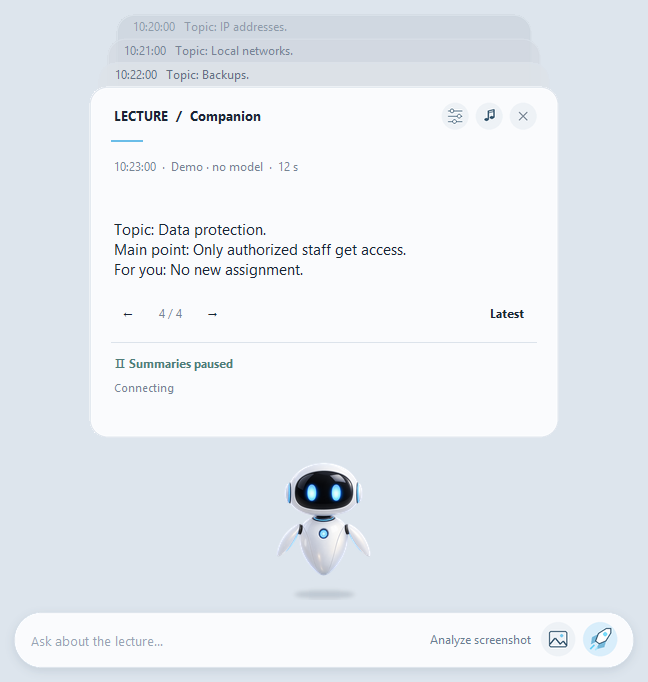

# Lecture Companion

<!-- public-release:start -->
Follow Teams lectures with local caption summaries and explanations of a selected slide.

**Windows 11 · x64 · Preview 2.4**

**[Download](https://github.com/popovantondev/LectureCompanion/releases/tag/v2.4)** · **[User guide](https://popovantondev.github.io/LectureCompanion/Guide-en.html)** · **[Report a problem](https://github.com/popovantondev/LectureCompanion/issues/new/choose)**

**Requirements and limitations:** Teams Desktop and compatible drivers; recommended: 32 GB RAM, internal SSD and 25 GB free for the parts, ZIP and extraction. EXE is unsigned; a second clean-PC check is pending.

**First steps:** Download all four parts and JoinPortable.cmd into one folder (about 5.8 GB). Run JoinPortable.cmd to verify and combine them, extract the entire ZIP and open LectureCompanion.exe.

**Application files:**

- [`JoinPortable.cmd`](https://github.com/popovantondev/LectureCompanion/releases/download/v2.4/JoinPortable.cmd)
- [`LectureCompanion-2.4-Final-Portable.zip.part01`](https://github.com/popovantondev/LectureCompanion/releases/download/v2.4/LectureCompanion-2.4-Final-Portable.zip.part01)
- [`LectureCompanion-2.4-Final-Portable.zip.part02`](https://github.com/popovantondev/LectureCompanion/releases/download/v2.4/LectureCompanion-2.4-Final-Portable.zip.part02)
- [`LectureCompanion-2.4-Final-Portable.zip.part03`](https://github.com/popovantondev/LectureCompanion/releases/download/v2.4/LectureCompanion-2.4-Final-Portable.zip.part03)
- [`LectureCompanion-2.4-Final-Portable.zip.part04`](https://github.com/popovantondev/LectureCompanion/releases/download/v2.4/LectureCompanion-2.4-Final-Portable.zip.part04)

**Checksums:** [`SHA256SUMS`](https://github.com/popovantondev/LectureCompanion/releases/download/v2.4/SHA256SUMS)
<!-- public-release:end -->

**Windows 11 · Portable · Version 2.4 · Local processing · Unsigned release preview**

[Deutsch](README.md) · [Русский](README.ru.md) · [English](README.en.md)

*Synthetic demo. No real meeting, captions, or participant data.*

Lecture Companion helps you follow IT classes in Microsoft Teams. It briefly summarizes new live captions and can explain the currently shared slide on request. Processing stays on your PC — no API key or cloud fallback.

## What it does

- Separates new captions from earlier context.
- Captures a fresh view of the shared screen when requested — not the meeting chat.
- Answers first in the lecture language and then in the interface language; matching languages are not repeated.
- Keeps up to ten answers in navigable cards, with quick access to questions and slide analysis.
- Prefers a compatible Intel NPU and otherwise uses a local CPU/GPU fallback.
- Supports German, English, and Russian for the interface and new answers.

## Download and start

Release 2.4 is publicly available as a pre-release. Download all four ZIP parts and `JoinPortable.cmd` from the [v2.4 release page](https://github.com/popovantondev/LectureCompanion/releases/tag/v2.4) and save them in the same folder. Double-click `JoinPortable.cmd`; it checks the part sizes and SHA-256 without installing anything. Extract the resulting ZIP fully to an internal SSD, then run `LectureCompanion.exe`. The [English step-by-step guide](https://popovantondev.github.io/LectureCompanion/Guide-en.html) explains how to use the app.

- [English step-by-step guide](docs/USER_GUIDE.en.md)
- Windows 11 x64; 32 GB RAM recommended. Compatible drivers and the Teams desktop app must already be installed.
- First startup and model initialization may take a while. The package is several GiB.

## Privacy and limitations

Captions and requested slide images are processed locally. The app has no cloud fallback and does not automatically upload them. Meeting content may contain personal data: follow your organization’s rules and do not share real captions or screenshots.

Answers can be wrong. Protected or minimized Teams windows and Teams updates may prevent caption or slide access. Performance and compatibility depend on the PC and its drivers. The EXE is unsigned, and a clean second-Windows-PC test is still outstanding.

## Documentation and development

[User guide](docs/USER_GUIDE.en.md) · [Architecture and build](docs/DEVELOPMENT.en.md) · [Verification report](VERIFICATION.en.md) · [Release checklist](PUBLIC-REPOSITORY.md)

Run model-free source checks with `python verify.py --node PATH_TO_NODE`; add `--ui` for native Windows UI checks. The synthetic demo starts without Teams or model requests: double-click `LectureCompanionDemo.exe`.

## Usage rights

The source code and robot artwork are public for viewing only and are not licensed for reuse. You may download and run the unmodified official EXE for personal, non-commercial use; modification or redistribution is not permitted. Third-party components keep their own licenses and notices (`LICENSE`, `THIRD_PARTY.md`). GitHub may permit viewing and forking public repositories; this is not technical copy protection.
