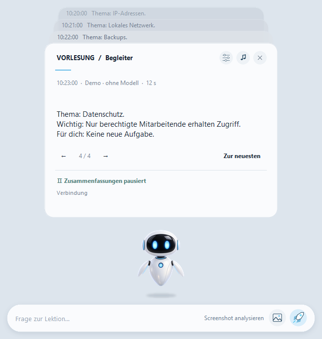

# Lecture Companion

[Benutzerhandbuch](https://popovantondev.github.io/LectureCompanion/Guide-de.html)

**Windows 11 · Portable · Version 2.4 · Lokale KI · Release-Preview, nicht signiert**

[Deutsch](README.md) · [Русский](README.ru.md) · [English](README.en.md)

*Synthetische Demo. Kein echtes Meeting, keine echten Untertitel und keine Teilnehmerdaten.*

Lecture Companion hilft dir, einer IT-Vorlesung in Microsoft Teams zu folgen. Die App fasst neue Liveuntertitel kurz zusammen und erklärt auf Wunsch die aktuell geteilte Folie. Die Verarbeitung erfolgt lokal auf dem PC — ohne ChatGPT-Konto, API-Schlüssel oder Cloud-Fallback.

## Was die App kann

- Erkennt neue Untertitel getrennt vom bisherigen Kontext.
- Nimmt auf Knopfdruck einen frischen Ausschnitt der Bildschirmfreigabe auf — nicht das Besprechungschatfenster.
- Antwortet zuerst in der Sprache der Vorlesung und danach in der Oberflächensprache; gleiche Sprachen werden nicht doppelt ausgegeben.
- Zeigt bis zu zehn Antworten als navigierbare Kartenstapel; Fragen und Folienanalyse sind direkt erreichbar.
- Verwendet bevorzugt einen kompatiblen Intel NPU, sonst einen lokalen CPU-/GPU-Fallback.
- Unterstützt Deutsch, Englisch und Russisch für Oberfläche und neue Antworten.

## Download und Start

Das Release 2.4 ist derzeit ein Entwurf und enthält noch keine öffentlichen Download-Dateien. Sobald ein vollständiges Portable-Paket veröffentlicht ist, stehen die konkreten ZIP-Teile und Prüfsummen auf der [Releases-Seite](https://github.com/popovantondev/LectureCompanion/releases). Die Schritt-für-Schritt-Anleitung ist bereits als [deutsches Markdown-Handbuch](docs/USER_GUIDE.de.md) lesbar.

- [Deutsche Schritt-für-Schritt-Anleitung](docs/USER_GUIDE.de.md)
- Windows 11 x64; 32 GB RAM empfohlen. Kompatible Treiber und die Teams-Desktop-App müssen bereits installiert sein.
- Erster Start und Modellinitialisierung können dauern. Das Paket ist mehrere GiB groß.

## Datenschutz und Grenzen

Untertitel und angeforderte Folienbilder werden lokal verarbeitet. Die App bietet keinen Cloud-Fallback und lädt sie nicht automatisch hoch. Meeting-Inhalte können personenbezogene Daten enthalten: beachte die Regeln deiner Organisation und teile keine echten Untertitel oder Screenshots.

KI-Antworten können Fehler enthalten. Geschützte oder minimierte Teams-Fenster sowie Änderungen an Teams können den Zugriff auf Untertitel oder Folien verhindern. Gerätegeschwindigkeit und Kompatibilität hängen von PC und Treibern ab. Die EXE ist nicht signiert; ein Test auf einem sauberen zweiten Windows-PC steht noch aus.

## Dokumentation und Entwicklung

[Handbuch](docs/USER_GUIDE.de.md) · [Architektur und Build](docs/ENTWICKLUNG.de.md) · [Prüfbericht](VERIFICATION.md) · [Release-Checkliste](PUBLIC-REPOSITORY.md)

Für Quellcode-Prüfungen: `python verify.py --node PATH_TO_NODE`; native Windows-UI-Prüfungen: `--ui`. Die synthetische Demo startet ohne Teams oder Modellabfragen: `LectureCompanionDemo.exe` per Doppelklick.

## Nutzungsrechte

Der Quellcode und das Roboterbild sind öffentlich nur zur Ansicht verfügbar und nicht zur Wiederverwendung lizenziert. Die offizielle, unveränderte EXE darf privat und nicht kommerziell heruntergeladen und gestartet werden; Ändern oder Weiterverteilen ist nicht erlaubt. Drittanbieterkomponenten behalten ihre eigenen Lizenzen und Hinweise (`LICENSE`, `THIRD_PARTY.md`). GitHub kann Anzeigen und Forken öffentlicher Repositories erlauben; das ist keine technische Kopiersperre.
