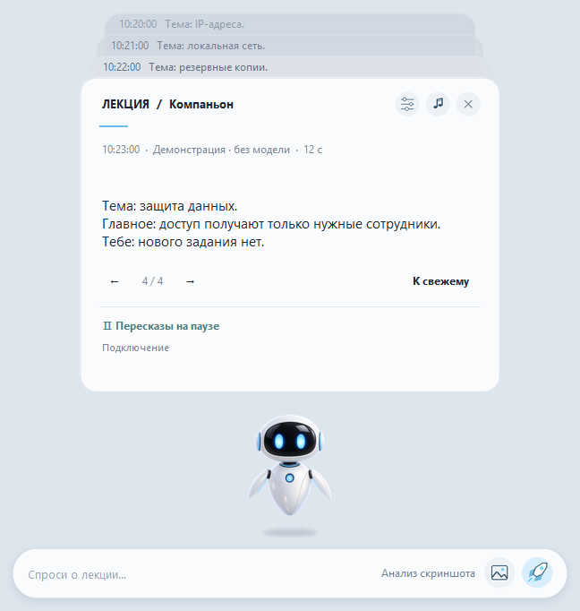

# Lecture Companion

**Windows 11 · Portable · Версия 2.4 · Локальная обработка · Предрелизная версия без подписи**

[Deutsch](README.md) · [Русский](README.ru.md) · [English](README.en.md)

*Синтетическое демо: без реальной встречи, субтитров и данных участников.*

Lecture Companion помогает следить за IT-лекциями в Microsoft Teams. Программа кратко пересказывает новые субтитры и по запросу объясняет текущий демонстрируемый слайд. Обработка остаётся на компьютере — без API-ключа и облачного резерва.

## Возможности

- Отделяет новые субтитры от прежнего контекста.
- По нажатию снимает свежий кадр демонстрации, а не чата встречи.
- Отвечает сначала на языке лекции, затем на языке интерфейса; совпадающий язык не дублируется.
- Хранит до десяти ответов в перелистываемых карточках; вопросы и разбор слайда доступны сразу.
- Предпочитает совместимый Intel NPU, иначе использует локальный CPU/GPU.
- Поддерживает немецкий, английский и русский для интерфейса и новых ответов.

## Скачать и запустить

Полная Portable-версия доступна на [странице GitHub Releases](https://github.com/popovantondev/LectureCompanion/releases). Из-за ограничения размера одного файла в GitHub Releases ZIP разделён на четыре части. Скачай все четыре части и `JoinPortable.cmd` в одну папку, затем запусти CMD двойным щелчком. Он проверяет размеры частей и контрольную сумму ZIP, использует встроенные средства Windows и ничего не устанавливает. После сборки полностью распакуй ZIP на внутренний SSD и открой `LectureCompanion.exe` двойным щелчком — отдельно устанавливать Python или пользоваться командной строкой не нужно.

- [Подробная инструкция на русском](Anleitungen/Russisch.html)
- Windows 11 x64; рекомендуется 32 ГБ ОЗУ. Совместимые драйверы и настольный Teams должны быть уже установлены.
- Первый запуск и загрузка моделей могут занять время. Архив занимает несколько гигабайт.

## Конфиденциальность и ограничения

Субтитры и запрошенные изображения слайдов обрабатываются локально. Программа не использует облачный резерв и не загружает их автоматически. Содержание встречи может включать личные данные: соблюдай правила организации и не публикуй реальные субтитры или скриншоты.

Ответы могут содержать ошибки. Защищённые или свёрнутые окна Teams и обновления программы могут помешать чтению субтитров или слайда. Скорость и совместимость зависят от компьютера и драйверов. EXE не подписан; проверка на чистом втором ПК с Windows ещё не проведена.

## Документация и разработка

[Руководство](Anleitungen/Russisch.html) · [Архитектура и сборка](docs/РАЗРАБОТКА.ru.md) · [Отчёт проверок](VERIFICATION.ru.md) · [Подготовка релиза](PUBLIC-REPOSITORY.md)

Проверки исходников без моделей: `python verify.py --node PATH_TO_NODE`; для интерфейса Windows добавь `--ui`. Синтетическое демо запускается без Teams и моделей — двойным щелчком по `LectureCompanionDemo.exe`.

## Права на использование

Исходный код и изображение робота доступны только для просмотра, без разрешения на повторное использование. Неизменённую официальную EXE разрешается скачать и запускать для личного некоммерческого использования; изменять или распространять её нельзя. На сторонние компоненты распространяются их собственные лицензии и уведомления (`LICENSE`, `THIRD_PARTY.md`). GitHub может разрешать просмотр и форки публичных репозиториев — это не техническая защита от копирования.
